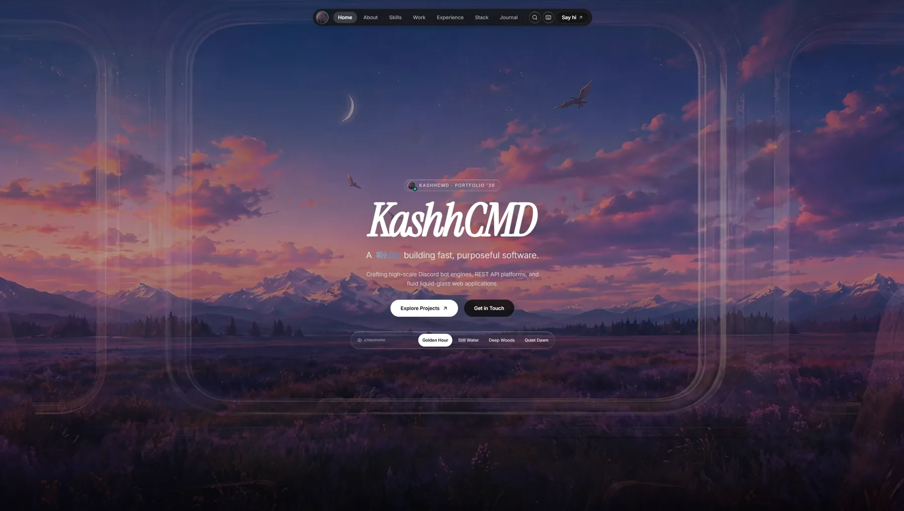

<div align="center">

# KashhCMD Portfolio (Development Version)

> **⚠️ This is the development version for testing with AI assistants.**
> **For the production site, visit [kashcmdd/portfolio](https://github.com/kashcmdd/portfolio)**

A cinematic dark portfolio landing page with liquid glass visuals, GSAP animations, HLS video backgrounds, and interactive project sections.

**[View live (Dev)](https://kashcmdd.github.io/portfolio-dev/)**



</div>

## Stack

React · TypeScript · Vite · Tailwind CSS · GSAP · Motion · HLS.js · Lucide React

## Getting started

```bash
npm install
npm run dev      # dev server
npm run build    # production build to dist/
npm run preview  # preview the production build
```

## Content

All content (identity, projects, journal, skills) lives in one file:

```
src/data/portfolioData.ts
```

Edit it, commit, and push — that's it.

## Deployment

The site is deployed to **GitHub Pages** automatically:

- `vite.config.ts` sets `base: '/portfolio-dev/'` for the Pages subpath.
- `.github/workflows/deploy.yml` builds on Node 20 and publishes `dist/` via `actions/deploy-pages` on every push to `main`.
- Push → wait ~1 minute → live at `https://kashcmdd.github.io/portfolio-dev/`.

## License

MIT